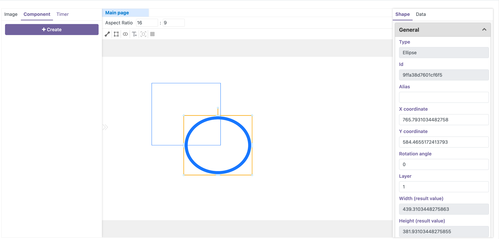
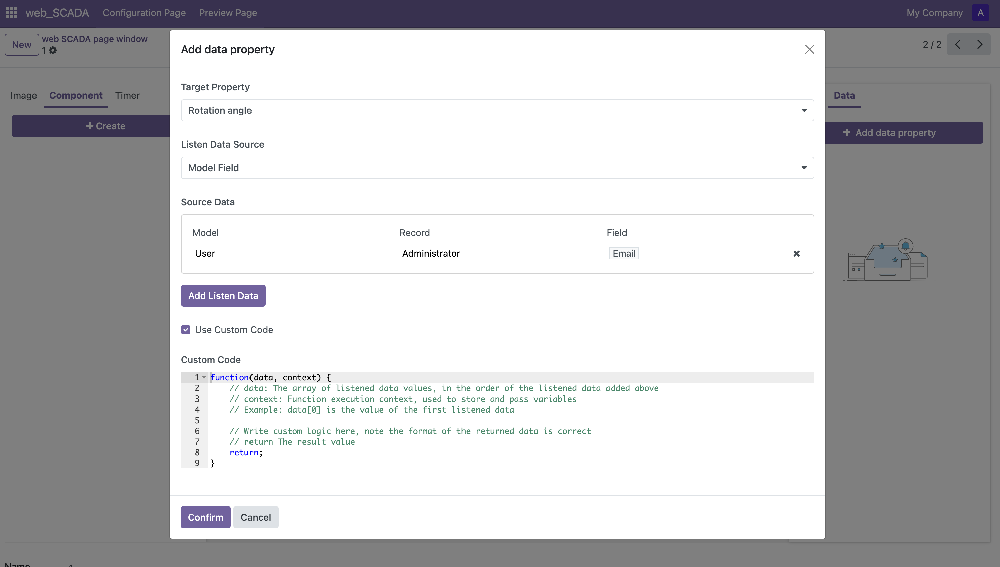

  

    

      

        
      

    

    

      <h3>Intelligent Visual Monitoring</h3>
      
Build enterprise-level monitoring centers for real-time production control. Based on Odoo's native component architecture, supporting rich data visualization solutions.

      

        Real-time Status Monitoring
        Adaptive Layout
      

    

  

  

    

      
    

    

      <h3>Low-Code Development Platform</h3>
      
Quickly build professional monitoring interfaces with zero barriers, providing a WYSIWYG editing experience. Built-in rich industrial component library to meet diverse needs.

      

        Drag-and-Drop Design
        Quick Template Reuse
      

    

  

  

    

      
    

    

      <h3>Data Intelligence Interconnection</h3>
      
Deep integration with Odoo business systems, breaking down data silos. Support multiple ways to access data, easily achieving data interconnection between modules.

      

        Automatic Data Sync
        Multiple Data Access Methods
        Data Visualization
      

    

  

  <h2>Technical Support</h2>
  
For custom development or consulting services, please contact us:

  

    <a href="mailto:birdix.goo@gmail.com">birdix.goo@gmail.com</a>
  

 