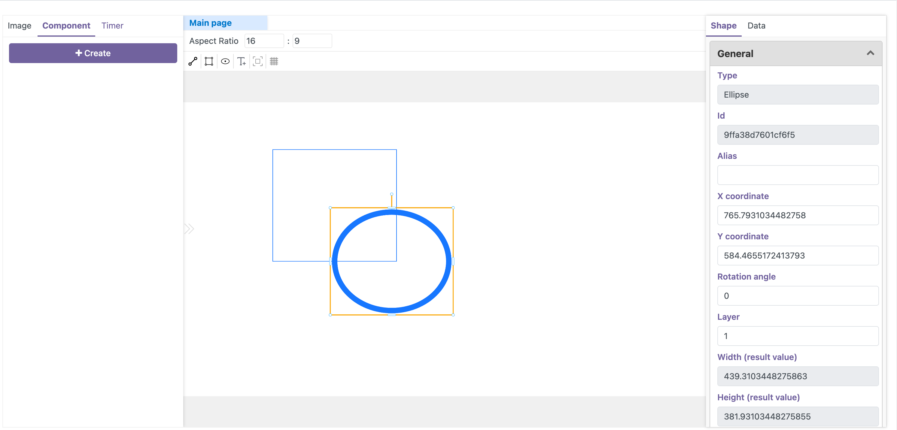
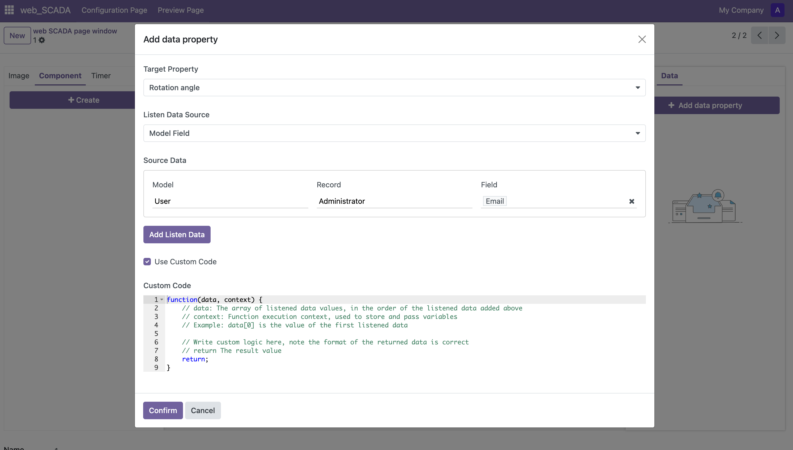

  

    

      

        
      

    

    

      <h3>智能可视化监控</h3>
      
打造企业级监控中心，实时掌控生产全局。基于Odoo原生的组件化架构，支持丰富的数据可视化方案。

      

        实时状态监测
        自适应布局
      

    

  

  

    

      
    

    

      <h3>低代码开发平台</h3>
      
零门槛快速搭建专业监控界面，所见即所得的编辑体验。内置丰富的工业组件库，满足多样化需求。

      

        拖拽式设计
        模板快速复用
      

    

  

  

    

      
    

    

      <h3>数据智能互联</h3>
      
深度集成Odoo业务系统，打通数据孤岛。支持多种方式接入数据，轻松实现模块间数据互联互通。

      

        自动数据同步
        多方式数据接入
        数据可视化
      

    

  

  <h2>技术支持</h2>
  
如需定制开发或咨询服务，请联系我们：

  

    <a href="mailto:birdix.goo@gmail.com">birdix.goo@gmail.com</a>
  

