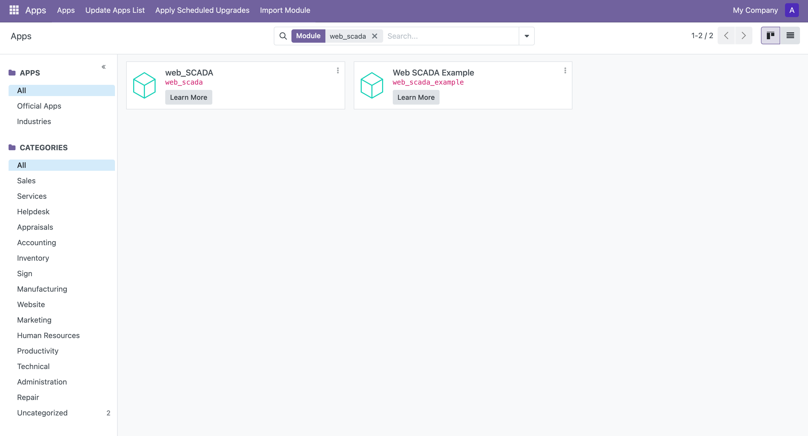

# Installation

## Environment Requirements

- Odoo version ≥ 18.0

## Installation Steps

### 1. Install Dependencies

First, you need to install the required Python dependencies. Execute in the module root directory:
```bash
pip install -r requirements.txt
```

### 2. Install Module

1. Log in to Odoo backend
2. Go to Apps module
3. Search and install `web_scada` module



### Example Data (Optional)

If you need to view example data to understand how to use the module, you can additionally install the `web_scada_example` module.

## Next Step

After installation is complete, you can continue reading the [Usage](./usage) to learn how to use this module. 