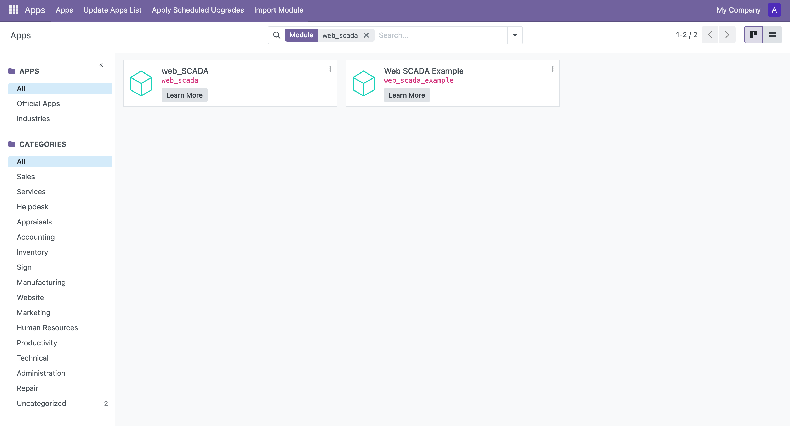

# 安装

## 环境要求

- Odoo 版本 ≥ 18.0

## 安装步骤

### 1. 安装依赖

首先需要安装所需的 Python 依赖包。在模块根目录下执行：
```bash
pip install -r requirements.txt
```

### 2. 安装模块

1. 登录 Odoo 后台
2. 进入应用模块（Apps）
3. 搜索并安装 `web_scada` 模块



### 示例数据（可选）

如果您需要查看示例数据来了解模块的使用方式，可以额外安装 `web_scada_example` 模块。

## 下一步

安装完成后，您可以继续阅读[使用指南](./usage)来了解如何使用本模块。