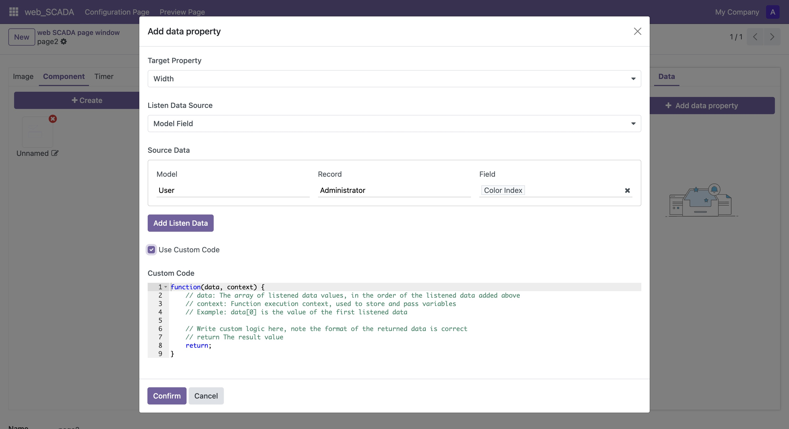
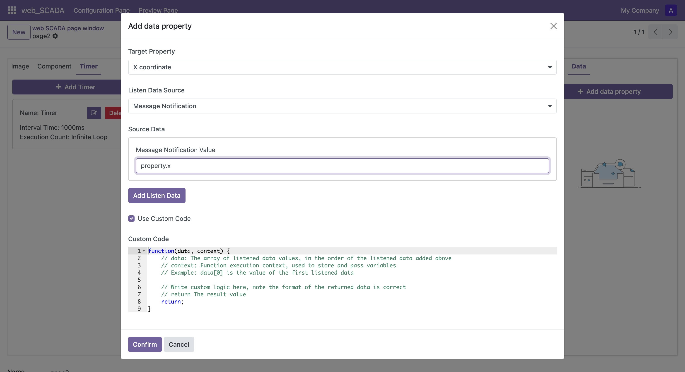
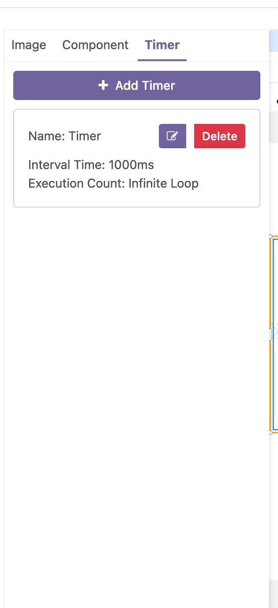
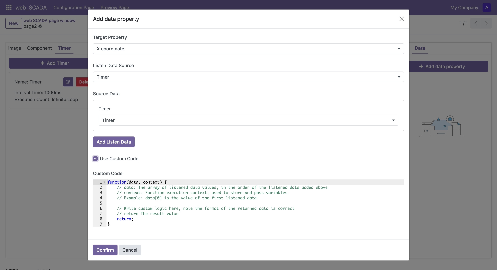

# Attributes

After selecting an element in the canvas, you can modify its inherent properties or bind dynamically changing properties.

## Modify Inherent Properties

After selecting a single element, you can modify its inherent properties in the right properties panel:

1. Find the property item you want to modify in the right properties panel
2. Enter the new property value
3. Press Enter or click a blank area to make the input box lose focus, and the new property value will take effect

## Bind Dynamic Properties

You can bind element properties with data sources to achieve dynamic effects:

1. Switch to the "Data" tab in the right properties panel
2. Click the "Add" button
3. In the popup configuration window, set:
   - Select the target property to change dynamically
   - Select the data trigger method:
     - Model data change: Triggered when data in the specified model changes
     - Message notification: Triggered when data is actively pushed from the backend
     - Timer: Triggered according to set time intervals
   - Select the specific trigger data source

### Model Data Trigger

When choosing model data change as the trigger method, you need to configure:

1. Select the target model name
2. Select the model field to monitor
3. Select the specific data record

When the specified field value of that record changes, it will automatically trigger property updates.



### Message Notification Trigger

After selecting the message notification method, property values will be updated based on data pushed from the backend. The backend can trigger data updates by calling the corresponding interface. For example:
```python
...env["scada.socket.io"].data_bus(pageID, {
    "property": {
        "x": 100
    }
})
```


### Using Timer

To use a timer to trigger property changes:

1. Add a timer in the "Timer" panel of the canvas component bar
   <div style="height: 500px;">
   
   </div>
2. Select that timer in the binding configuration
3. By default, the property value will be set to the number of timer executions



### Custom Value Conversion

You can write code to customize how trigger data is converted to target property values:

1. Enable "Custom Code" in the binding configuration
2. Write data conversion logic
3. Return the final property value to be set

Through property binding, you can give canvas elements richer interactive effects and dynamic presentations. 