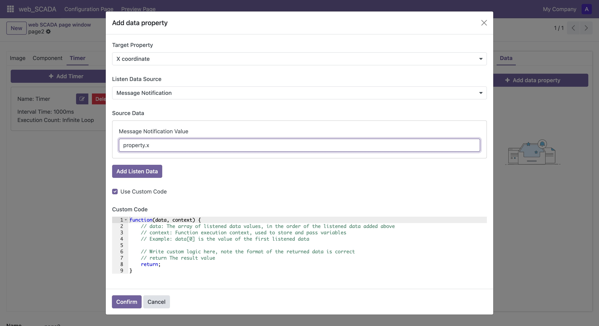

# 修改/绑定属性

在画布中选中元素后，您可以修改元素的固有属性或为其绑定动态变化的属性，也可以配置响应的事件执行代码。

## 修改固有属性

选择单个元素后，您可以在右侧属性栏中修改其固有属性：

1. 在右侧属性栏找到需要修改的属性项
2. 输入新的属性值
3. 按回车键或点击空白处使输入框失去焦点，新的属性值即可生效

## 绑定动态属性

您可以将元素的属性与数据源进行绑定，实现动态效果：

1. 在右侧属性栏切换到"数据"标签页
2. 点击"添加"按钮
3. 在弹出的配置窗口中设置：
   - 选择要动态变化的目标属性
   - 选择数据触发方式：
     - 模型数据变化：当指定模型中的数据发生变化时触发
     - 消息通知：由后端主动推送数据时触发
     - 定时器：按照设定的时间间隔触发
   - 选择具体的触发数据源

### 模型数据触发

当选择模型数据变化作为触发方式时，需要配置：

1. 选择目标模型名称
2. 选择要监听的模型字段
3. 选择具体的数据记录

当该记录的指定字段值发生变化时，将自动触发属性更新。


### 消息通知触发

选择消息通知方式后，属性值将根据后端推送的数据进行更新。后端可以通过调用相应接口来触发数据更新。比如：
```python
...env["scada.socket.io"].data_bus(页面ID, {
    "property": {
        "x": 100
    }
})
```


### 使用定时器

如需使用定时器触发属性变化：

1. 在画布组件栏的"定时器"面板中添加定时器
   <div style="height: 500px;">
   
   </div>
2. 在绑定配置中选择该定时器
3. 默认情况下，属性值会被设置为定时器的执行次数


### 自定义数值转换

您可以通过编写代码来自定义如何将触发数据转换为目标属性值：

1. 在绑定配置中启用"自定义代码"
2. 编写数据转换逻辑
3. 返回最终要设置的属性值

在编写自定义转换代码时，您可以使用`context`对象，它具有以下属性：

- **context.orm**：提供与Odoo前端相同的ORM操作接口，可用于读取或修改数据库中的数据
  ```javascript
  // 示例：使用orm写入数据
  context.orm.write('model_name', [1, 2, 3], { field_name: 'new_value' })
  ```

- **context.props**：当前图形属于某个组件时，可以通过此属性获取组件接收的所有参数的当前值
  ```javascript
  // 示例：获取组件参数
  const paramValue = context.props.paramName
  ```

示例：根据温度值改变元素颜色
```javascript
// 假设触发数据是温度值
function (data, context) {
  const value = data[0];
  // 获取组件中的温度阈值参数
  const threshold = context.props.tempThreshold || 30;
  
  // 根据温度值返回不同的颜色
  if (value > threshold) {
    return 'red'  // 温度过高显示红色
  } else {
    return 'green'  // 温度正常显示绿色
  }
}
```

通过属性绑定，您可以让画布中的元素具有更丰富的交互效果和动态表现。

