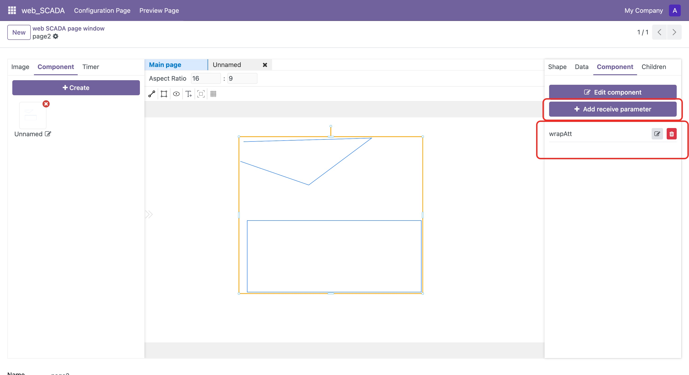
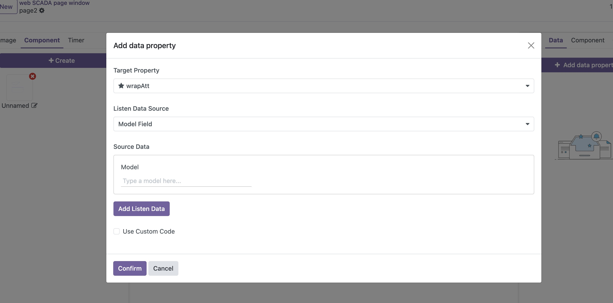
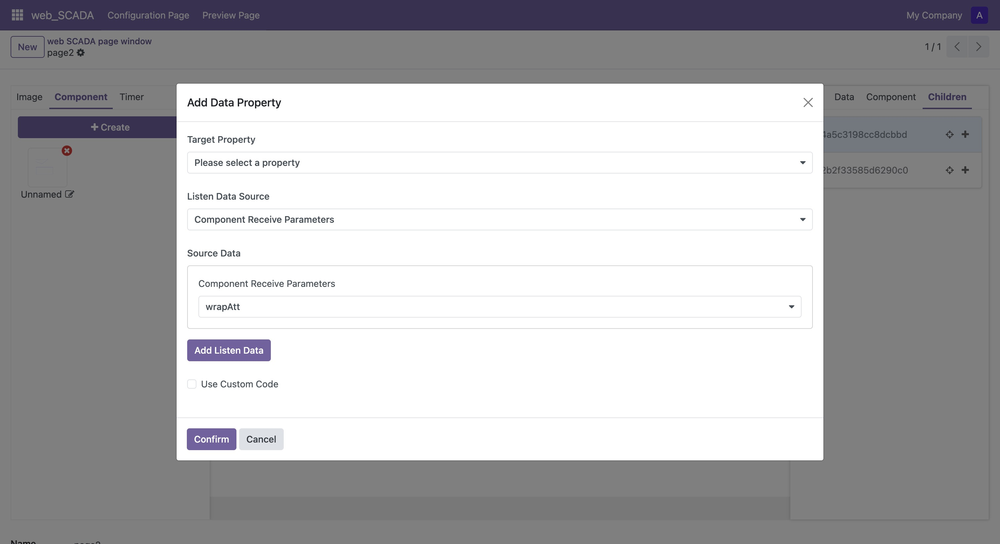

# Component Attributes

Components can expose receiving properties to control the property settings of internal elements. Here's how to set and use component receiving properties:

## Set Receiving Properties

1. Select the target component in the canvas
2. Find the component section in the properties panel
3. Click the "Add Receiving Property" button to create a new receiving property

## Bind Receiving Properties

After setting up receiving properties, you can:

1. Set dynamic properties following the steps in [Modify/Bind Attributes](./bind-attributes)
2. In the target property selection bar, you will see receiving property options marked with an asterisk (*)
3. After selection, when the monitored property changes, the corresponding receiving property value will also update

## Bind Child Element Properties

To associate component receiving properties with internal element properties:

1. Select the child element in the properties panel
2. Click the "+" button to add dynamic property binding
3. Set dynamic properties following the steps in [Modify/Bind Attributes](./bind-attributes). In the data source selection, you can choose the component's receiving properties. After setting, when the component receiving property value changes, the corresponding element property will update accordingly

> Note: All the above operations can be set while editing the component

Through this method, you can create more flexible reusable components and achieve dynamic control of internal component properties. 