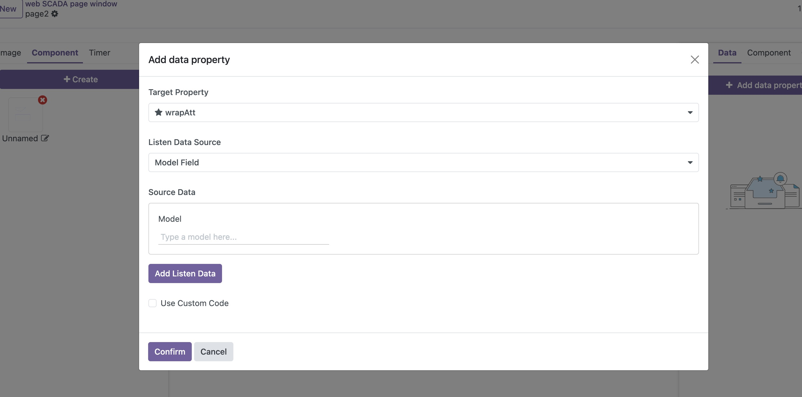

# 修改/绑定组件属性

组件可以对外暴露接收属性，通过更改这些属性来控制内部元素的属性设置。下面介绍如何设置和使用组件的接收属性：

## 设置接收属性

1. 在画布中选择目标组件
2. 在右侧属性栏中找到组件栏
3. 点击"添加接收属性"按钮来创建新的接收属性

## 绑定接收属性

设置好接收属性后，您可以:

1. 按照[修改/绑定属性](./bind-attributes)的步骤设置动态属性
2. 在目标属性选择栏中，您会看到带有星号(*)的接收属性选项
3. 选择后，当监听的属性发生变化时，对应的接收属性值也会更新

## 绑定子元素属性

要将组件的接收属性与内部元素的属性关联：

1. 在右侧属性栏中选择子元素
2. 点击"+"号添加动态属性绑定
3. 按照[修改/绑定属性](./bind-attributes)的步骤设置动态属性，在数据源选择中，您可以选择组件的接收属性，这样设置后，当组件接收属性值变化时，对应的元素属性也会随之更新

> 注意：以上所有操作都可以在编辑组件时进行设置

通过这种方式，您可以创建更灵活的可复用组件，实现组件内部属性的动态控制。