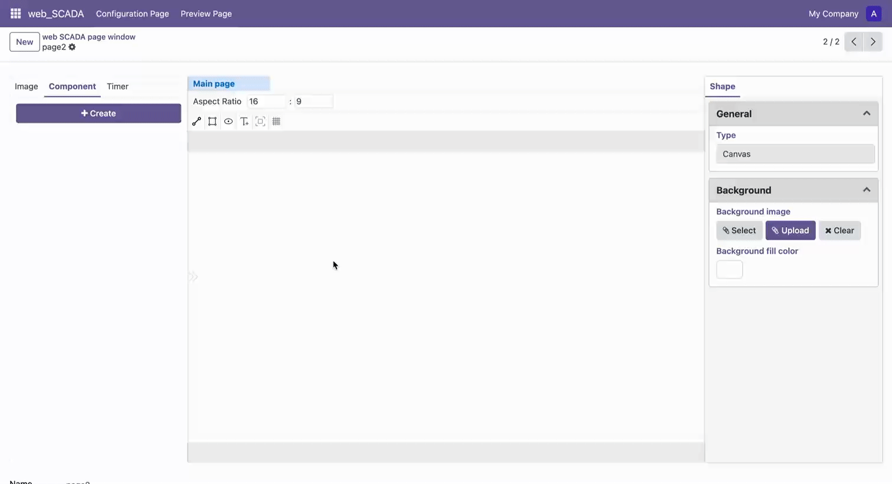

# Draw Ellipse

1. Select the "Draw Ellipse" tool in the toolbar to enter ellipse drawing mode
2. Left-click on the canvas to set the center point, move the mouse to the target position
3. Left-click again to set the outer boundary point, completing the ellipse drawing
4. During drawing, hold the Shift key to constrain drawing to a circle
5. Press Space key to confirm completion of drawing, or press ESC key to cancel current operation
6. Press ESC key to exit ellipse drawing mode

 