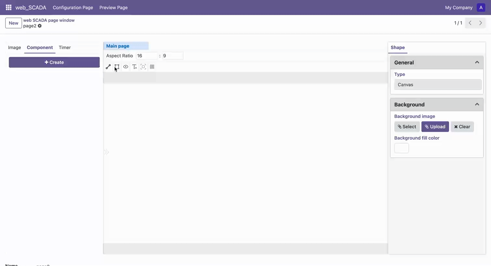

# Draw Line

## Basic Operations

1. Select the "Draw Line" tool in the toolbar to enter line drawing mode
2. Left-click on the canvas to set the starting point, move the mouse to the target position
3. Left-click again to set the endpoint, completing a single line segment drawing
4. During drawing, hold the Shift key to constrain drawing to horizontal or vertical direction
5. Press Space key to confirm completion of drawing, or press ESC key to cancel current operation
6. Press ESC key again to exit line drawing mode

## Draw Multiple Line Segments

To draw a path composed of multiple line segments:

1. After completing the first line segment, continue to left-click to set the next endpoint
2. Repeat this operation until all line segments are drawn
3. Press Space key to confirm completion of the overall drawing, or press ESC key to cancel current operation

 