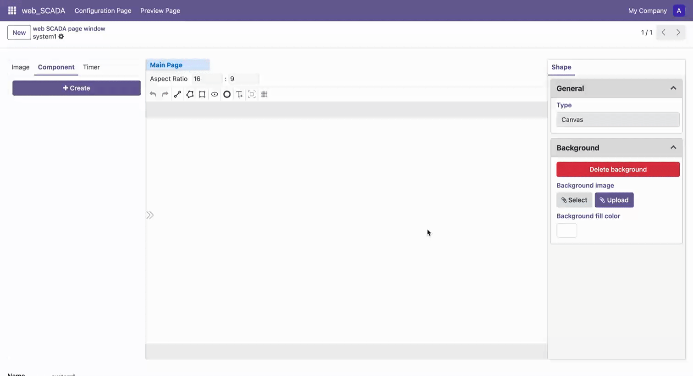

# Draw Polygon

## Basic Operations

1. Select the "Draw Polygon" tool in the toolbar to enter polygon drawing mode
2. Left-click on the canvas to set the starting point, move the mouse to the target position
3. Left-click to set the next vertex, completing one edge
4. During drawing, hold the Shift key to constrain drawing to horizontal or vertical direction
5. Press Space key to confirm completion (the polygon will be automatically closed), or press ESC key to cancel current operation
6. Press ESC key again to exit polygon drawing mode

## Draw Polygon

To draw a polygon with multiple edges:

1. After completing the first edge, continue to left-click to set the next vertex
2. Repeat this operation until all edges are drawn
3. Press Space key to confirm completion (the system will automatically connect the last point with the starting point to form a closed shape), or press ESC key to cancel current operation

