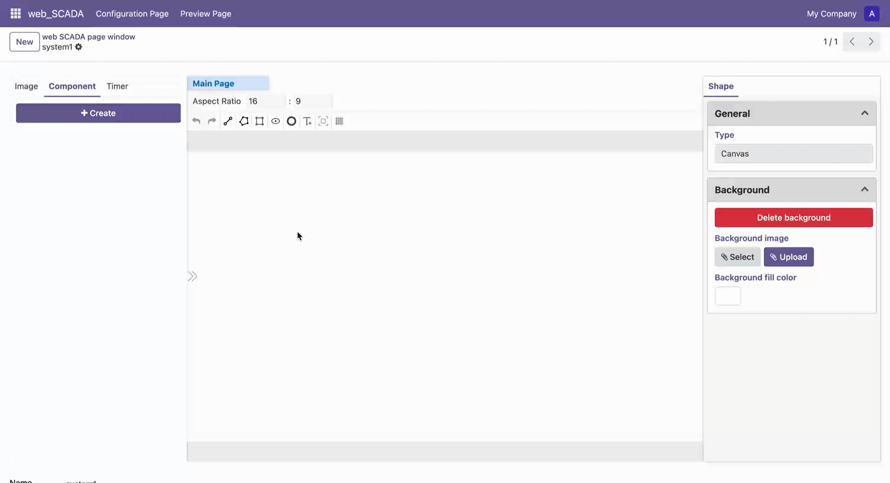

# Draw Ring

1. Select the "Draw Ring" tool in the toolbar to enter ring drawing mode
2. Left-click on the canvas to set the center point of the ring
3. Move the mouse and left-click to set the outer radius of the ring
4. Move the mouse and left-click again to set the inner radius of the ring
5. Press Space key to confirm completion of drawing, or press ESC key to cancel current operation
6. Press ESC key to exit ring drawing mode

