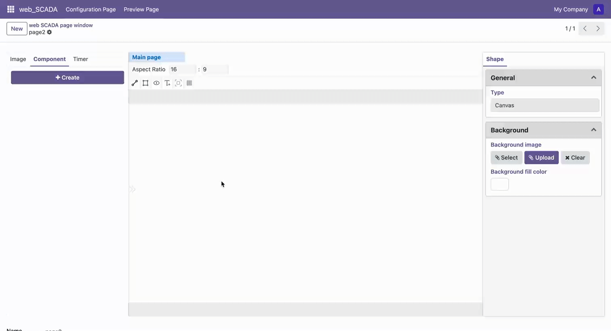

# Draw Text

## Basic Operations

1. Select the "Draw Text" tool in the toolbar to enter text drawing mode
2. Left-click on the canvas to set the starting point, move the mouse to the target position
3. Left-click again to set the endpoint, completing the text box drawing
4. The system will automatically generate default text inside the text box
5. Press Space key to confirm completion of drawing, or press ESC key to cancel current operation
6. Press ESC key to exit text drawing mode

## Edit Text

1. After exiting text drawing mode, select the text element
2. Modify the text content in the properties panel
3. You can adjust text properties such as font, size, color, etc.

 