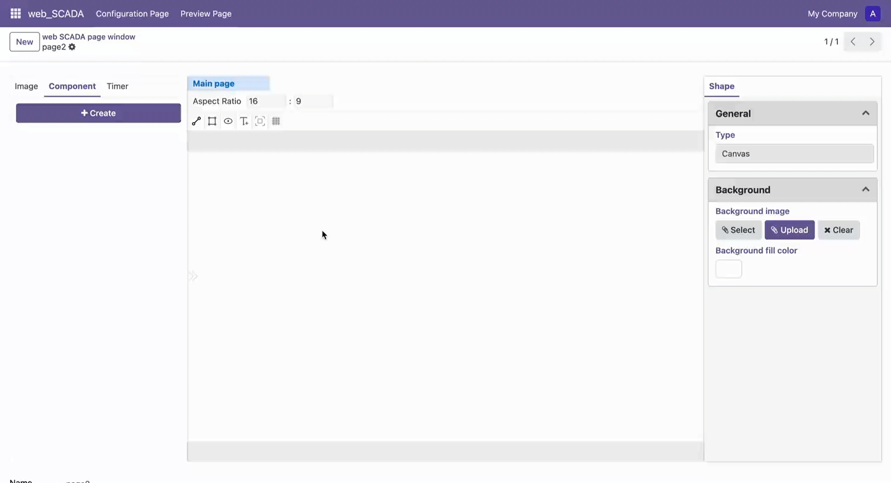

# Make Components

Components are reusable design element collections that can improve design efficiency and maintain design consistency. Here are the steps to create and use components:

## Create Component

1. Click the "Create" button in the left component bar to create a new component
2. The system will automatically open a new component editing canvas
3. Design and edit the component in the canvas
4. After editing, use the shortcut key to save:
   - Windows: Ctrl + S
   - Mac: Command + S

## Manage Components

After saving a component, you can:
- Rename the component in the component bar
- Drag the component to the main canvas to use it
- Double-click the component to edit it

## Use Components

1. Find the component you need from the left component bar
2. Drag the component to where you want to place it on the canvas
3. Adjust the component's size and properties as needed

 