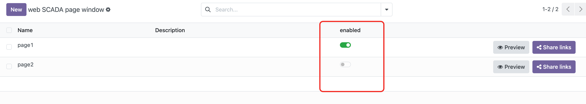
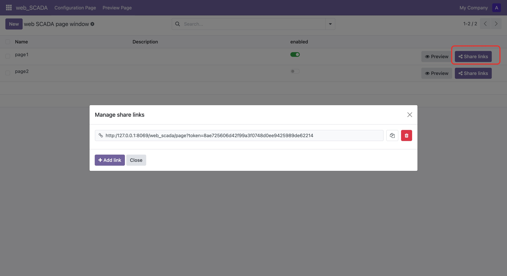

# 展示页面

在使用预览功能之前，请确保先开启页面的展示功能。具体步骤如下：

1. 进入列表界面
2. 将页面设置为"开启"状态

开启展示功能后，您可以通过以下两种方式预览和分享您的作品：

## 系统内预览

1. 进入Odoo系统后，点击本模块下的"预览页面"菜单
2. 在左侧页面列表中选择需要展示的页面
3. 页面将在主视图区域显示
4. 点击页面右上方的全屏按钮可进行全屏展示

## 外部链接分享

1. 点击"分享外链"按钮
2. 添加允许外部访问的链接地址
3. 保存后，可以将链接分享给其他人
4. 其他用户可以通过浏览器直接访问此链接查看页面
5. 如需停止分享，删除对应的外链即可，外部访问将立即失效

