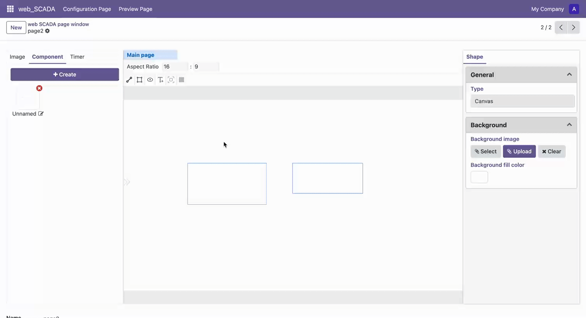

# 元素变形

在非绘制模式下,您可以对画布上的元素进行变形操作:

1. **选择元素**
   - 单击选择单个元素
   - 按住 Shift 键可以多选元素
   
2. **变形操作**
   - 选中元素后会出现变形框,框上有8个控制点(4个顶角和4个边的中点)
   - 拖动这些控制点可以改变元素的大小和形状
   - 使用顶角控制点按住 Shift 键拖动可以保持原有比例进行缩放

   > 注意：变形操作只会修改元素的 x 和 y 轴缩放比例(scale)，不会改变元素本身的宽度和高度属性值
   
3. **旋转操作**
   - 变形框顶部有一个圆形控制点
   - 拖动这个圆点可以对元素进行旋转

这些变形操作可以帮助您精确调整元素的大小、形状和角度,使设计更加灵活。

