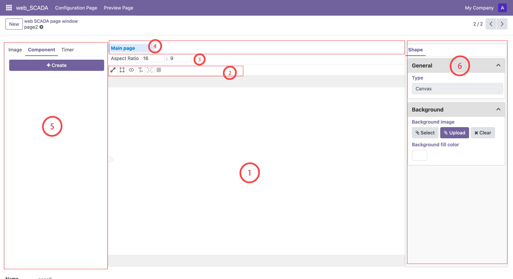

# 界面介绍

## 主要区域说明

### 1. 画布区域
这是绘制的核心区域。在此区域中，您可以：
- 使用鼠标滚轮进行画布的缩放
- 按住鼠标右键拖动画布位置
- 在非绘制模式下，通过左键拖动进行元素框选
- 按住 Shift 键可在已有选择的基础上追加选择新的元素

### 2. 工具栏
提供多种画布操作工具，包括：
- 绘制模式切换
- 画布位置重置
- 网格线显示控制等功能

### 3. 画布比例设置
用于调整画布的宽高比例，这将直接影响最终作品的展示效果。建议根据您的具体使用场景选择合适的比例。

### 4. 画布切换栏
用于管理和切换不同的画布：
- 「Main page」为主画布
- 其他为组件画布
- 在组件画布中编辑后，使用快捷键 Ctrl+S（Mac 用户使用 Command+S）保存组件

### 5. 组件面板
提供以下功能：
- 查看所有已保存的组件
- 管理已上传的图片资源
- 设置定时器（用于控制动画效果的执行频率）

### 6. 属性面板
- 当选中元素时：显示并允许修改该元素的属性
- 未选中元素时：显示画布的整体属性设置